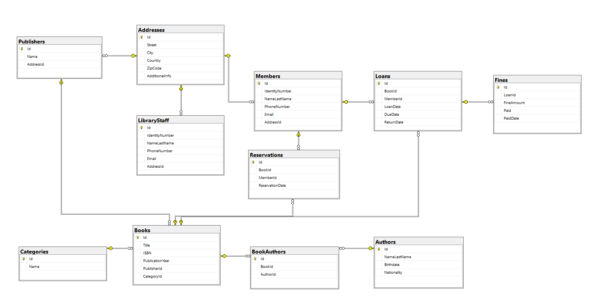

# Library Management System

This project includes a relational library database schema created using SQL and some procedures and views written to interact with this database. The database is designed to manage various information such as books, authors, members, borrowing, and reservations for libraries.

## Library Database Diagram

## Features

- **Addresses**: Stores library address information.
- **Publishers**: Contains information about book publishers.
- **Categories**: Defines book categories.
- **Authors**: Stores information about book authors.
- **Books**: Manages books in the library.
- **Book-Author Relationships**: Defines the relationship between a book and one or more authors.
- **Members**: Holds information about library members.
- **Library Staff**: Contains information about library staff.
- **Loans**: Manages book borrowing transactions.
- **Reservations**: Tracks book reservations.
- **Fines**: Calculates and records late fees.

## Database Schema

The database includes the following tables:

- **Addresses**: Address information.
- **Publishers**: Publishers and address relationships.
- **Categories**: Book categories.
- **Authors**: Authors.
- **Books**: Books, related to publishers and categories.
- **BookAuthors**: Relationships between books and authors.
- **Members**: Member information and address relationships.
- **LibraryStaff**: Library staff information and address relationships.
- **Loans**: Book borrowing information.
- **Reservations**: Book reservation information.
- **Fines**: Fines for overdue books.

## Relationships

The relationships between the tables in the database are as follows:

- **Addresses** table:
  - Related to **Publishers** table through `AddressId`.
  - Related to **Members** table through `AddressId`.
  - Related to **LibraryStaff** table through `AddressId`.

- **Publishers** table:
  - Related to **Books** table through `PublisherId`.

- **Categories** table:
  - Related to **Books** table through `CategoryId`.

- **Authors** table:
  - Related to **BookAuthors** table through `AuthorId`.

- **Books** table:
  - Related to **BookAuthors** table through `BookId`.
  - Related to **Loans** table through `BookId`.
  - Related to **Reservations** table through `BookId`.

- **BookAuthors** table:
  - Related to **Books** table through `BookId`.
  - Related to **Authors** table through `AuthorId`.

- **Members** table:
  - Related to **Loans** table through `MemberId`.
  - Related to **Reservations** table through `MemberId`.

- **LibraryStaff** table:
  - (No direct relationships with other tables.)

- **Loans** table:
  - Related to **Books** table through `BookId`.
  - Related to **Members** table through `MemberId`.
  - Related to **Fines** table through `LoanId`.

- **Reservations** table:
  - Related to **Books** table through `BookId`.
  - Related to **Members** table through `MemberId`.

- **Fines** table:
  - Related to **Loans** table through `LoanId`.

## Procedures

- **`BorrowBook`**: Handles the process of borrowing a book.
- **`ReturnBook`**: Manages the return of a book and calculates any late fees.
- **`GetBookAuthors`**: Lists the authors of a book.

## Views

- **`BookStatus`**: Shows the current status of books (whether they are on loan or available).
- **`MemberLoans`**: Lists the books borrowed by members and their details.
- **`BooksByCategory`**: Shows the number of books by category.
